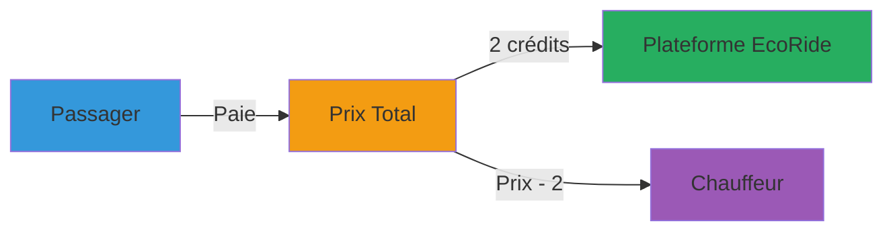
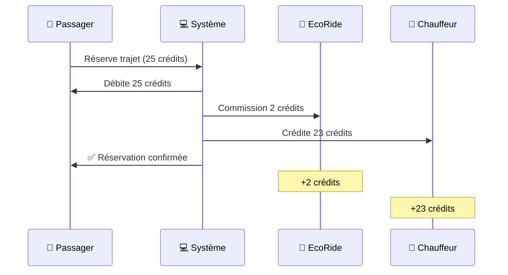
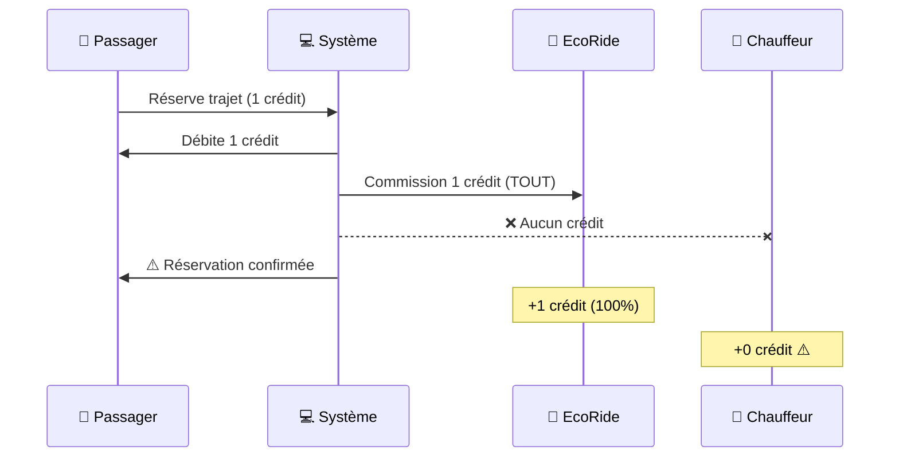
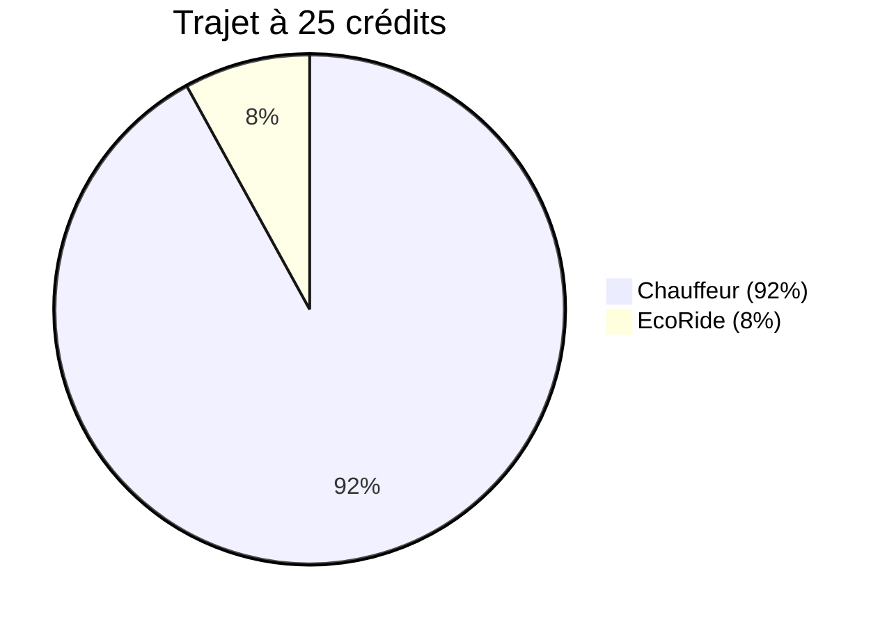
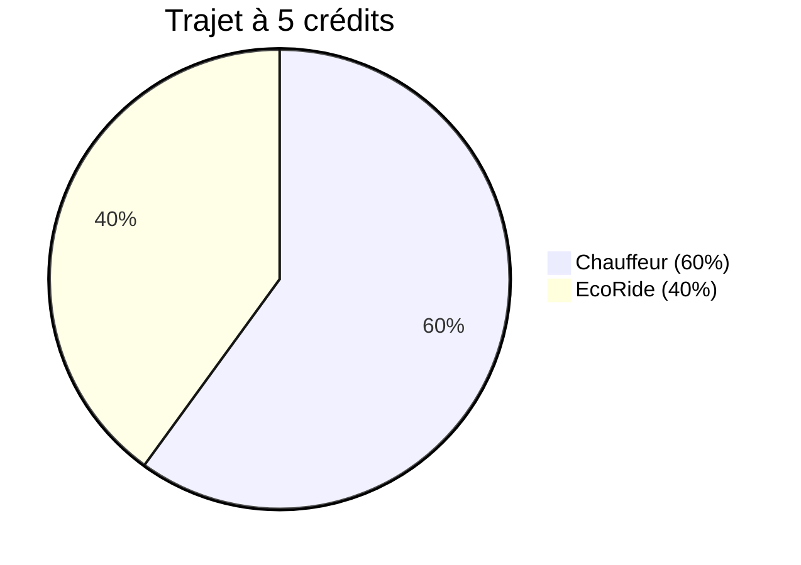
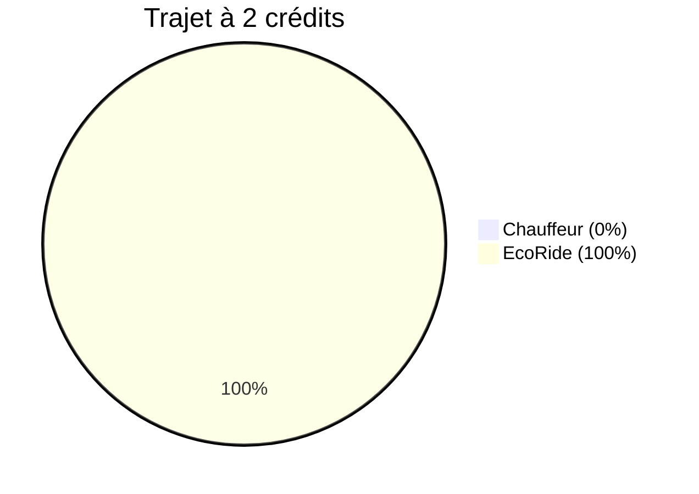
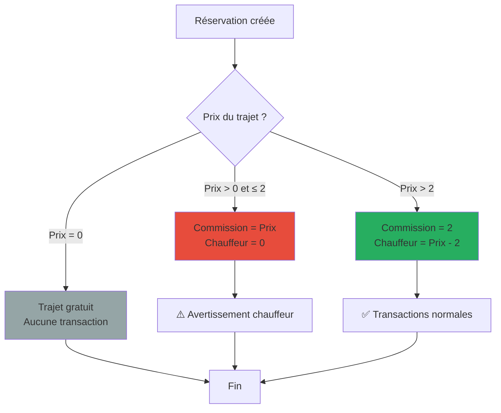
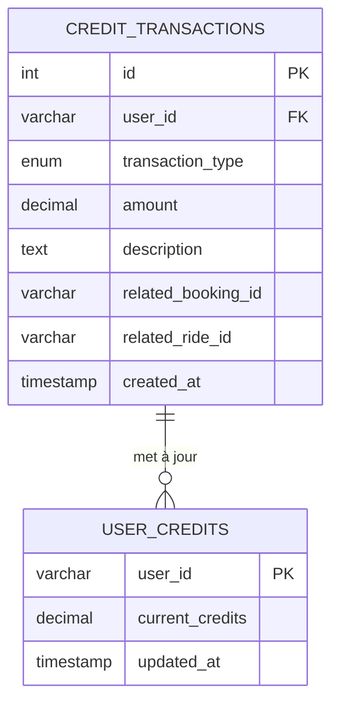
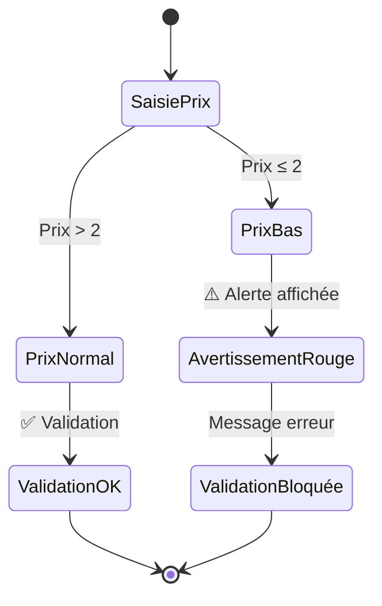
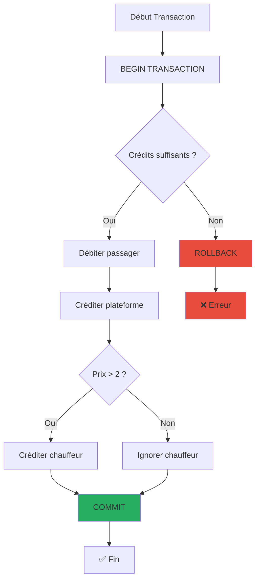

# 📊 Diagrammes - Système de Commission EcoRide

## 🎯 Vue d'ensemble



---

## 💰 Flux de Paiement - Cas Normal (Prix > 2 crédits)



**Résultat** :
- Passager : -25 crédits
- EcoRide : +2 crédits
- Chauffeur : +23 crédits

---

## ⚠️ Flux de Paiement - Prix Bas (Prix ≤ 2 crédits)



**Résultat** :
- Passager : -1 crédit
- EcoRide : +1 crédit (tout)
- Chauffeur : +0 crédit ⚠️

---

## 📈 Répartition par Tranche de Prix







---

## 🔄 Diagramme de Décision



---

## 🗄️ Schéma Base de Données



**Types de transactions pour une réservation :**

1. **Transaction DEPENSE** (Passager)
   - `transaction_type` = 'depense'
   - `amount` = prix total
   - `user_id` = passager

2. **Transaction COMMISSION** (Plateforme)
   - `transaction_type` = 'commission'
   - `amount` = 2 (ou prix si ≤ 2)
   - `user_id` = passager

3. **Transaction GAIN** (Chauffeur) - *Si prix > 2*
   - `transaction_type` = 'gain'
   - `amount` = prix - 2
   - `user_id` = chauffeur

---

## 🎨 Interface Utilisateur - Avertissement



**États de l'interface :**
- **Prix > 2** : Pas d'avertissement, validation OK
- **Prix ≤ 2** : Avertissement rouge visible
- **Prix = 0** : Trajet gratuit, pas d'avertissement

---

## 📊 Graphique des Revenus

```
Revenus par Prix de Trajet
━━━━━━━━━━━━━━━━━━━━━━━━━━━━━━━━━━━━━━━━━━━

Prix    │ EcoRide │ Chauffeur
────────┼─────────┼───────────
1 €     │   1 €   │   0 € ⚠️
2 €     │   2 €   │   0 € ⚠️
3 €     │   2 €   │   1 €
5 €     │   2 €   │   3 €
10 €    │   2 €   │   8 €
25 €    │   2 €   │  23 €
50 €    │   2 €   │  48 €
100 €   │   2 €   │  98 €

📈 Plus le prix augmente, plus la part du chauffeur augmente
⚠️  Prix recommandé minimum : 3 € (pour que le chauffeur gagne)
```

---

## 🔐 Sécurité des Transactions



**Garanties** :
- ✅ Atomicité : Tout ou rien
- ✅ Cohérence : Solde toujours correct
- ✅ Isolation : Transactions séparées
- ✅ Durabilité : Enregistrement permanent

---

## 📱 Vue Mobile - Avertissement

```
┌─────────────────────────────────┐
│  Proposer un Trajet             │
├─────────────────────────────────┤
│                                 │
│  💰 Prix par place              │
│  ┌───────────────────────────┐  │
│  │ 1              crédits    │  │
│  └───────────────────────────┘  │
│                                 │
│  ⚠️  Vous ne recevrez aucun    │
│      crédit avec ce prix       │
│      (commission plateforme    │
│      de 2 crédits)             │
│                                 │
│  ℹ️  Commission EcoRide :      │
│     2 crédits par trajet.      │
│     Si prix ≤ 2, la plateforme │
│     prendra la totalité.       │
│                                 │
│  [ Publier le covoiturage ]    │
│                                 │
└─────────────────────────────────┘
```

---

## 🎯 Résumé Visuel

```
┌─────────────────────────────────────────┐
│   SYSTÈME DE COMMISSION ECORIDE         │
├─────────────────────────────────────────┤
│                                         │
│  Règle Simple :                         │
│  ════════════                           │
│                                         │
│  🏢 EcoRide gagne toujours 2 crédits   │
│  🚗 Chauffeur reçoit le reste          │
│                                         │
│  Cas particulier :                      │
│  ════════════════                       │
│                                         │
│  Si Prix ≤ 2 crédits                   │
│  → EcoRide prend TOUT                   │
│  → Chauffeur reçoit 0                   │
│                                         │
│  Exemples :                             │
│  ════════                               │
│                                         │
│  25 crédits → EcoRide: 2, Vous: 23 ✅   │
│   5 crédits → EcoRide: 2, Vous:  3 ✅   │
│   2 crédits → EcoRide: 2, Vous:  0 ⚠️   │
│   1 crédit  → EcoRide: 1, Vous:  0 ⚠️   │
│                                         │
└─────────────────────────────────────────┘
```

---

## 📚 Légende

| Symbole | Signification |
|---------|---------------|
| ✅ | Valide, fonctionne correctement |
| ⚠️ | Avertissement, attention requise |
| ❌ | Erreur, action bloquée |
| 🏢 | Plateforme EcoRide |
| 🚗 | Chauffeur |
| 🧳 | Passager |
| 💰 | Crédits / Argent |
| 📊 | Statistiques / Graphiques |
| 🔐 | Sécurité |

---

**Version** : 1.0  
**Date** : 25 novembre 2025  
**Auteur** : EcoRide Team
